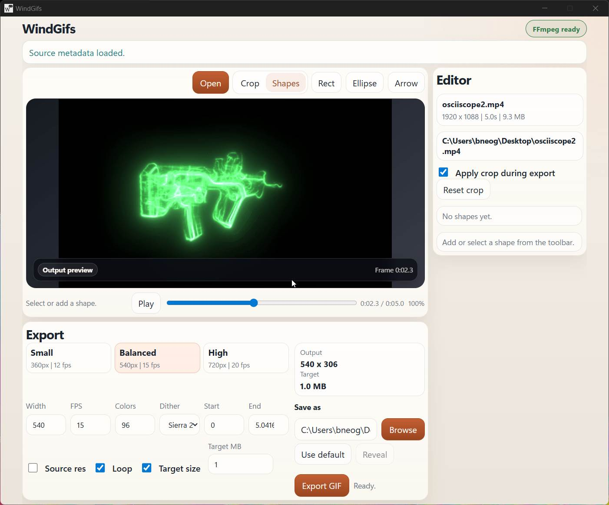

# WindGifs



WindGifs is a Windows-first desktop tool for turning short video clips into clean,
controllable GIFs. It is built with Tauri, React, TypeScript, and FFmpeg.

## Features

- Open one or many local video files with a native Windows file picker.
- Batch export selected videos from a thumbnail rail with per-video checkboxes.
- Edit export settings per video, or enable global settings to share output controls across the whole batch.
- Choose Fast, Balanced, or Best target-size compression effort.
- Export batches in parallel with a conservative two-job limit.
- Preview the source video and inspect an output-quality frame in the main stage.
- Zoom the preview with the mouse wheel and pan with middle-mouse drag when zoomed in.
- Trim the exported range.
- Crop with direct mouse controls.
- Add and edit rectangle, ellipse, and arrow markup layers.
- Export GIFs with width, source-resolution, FPS, palette size, dithering, loop, and target-size controls.
- Uses FFmpeg/FFprobe for deterministic exports from the original source video.

## Development

Requirements:

- Windows
- Node.js
- Rust
- FFmpeg and FFprobe

Install dependencies:

```powershell
npm install
```

Run the desktop app in development:

```powershell
npm run tauri dev
```

Build the app:

```powershell
npm run tauri build
```

WindGifs looks for `ffmpeg.exe` and `ffprobe.exe` in `tools/ffmpeg/`, then on
your system `PATH`. The binaries are not committed to this repository.

## Validation

Useful checks before publishing changes:

```powershell
node .\node_modules\typescript\bin\tsc --noEmit
cargo test --manifest-path .\src-tauri\Cargo.toml
npm run build
npm run tauri build
```

## License

WindGifs is open source under the [MIT License](LICENSE).
